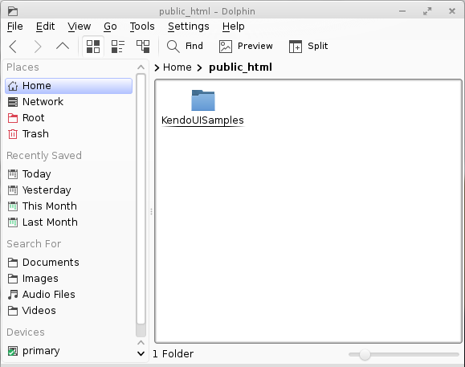
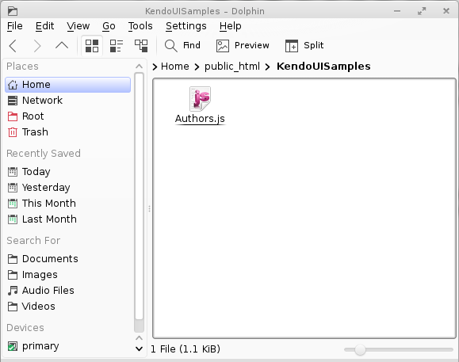
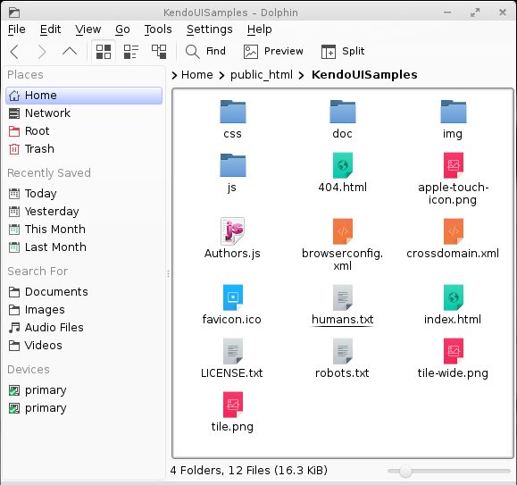
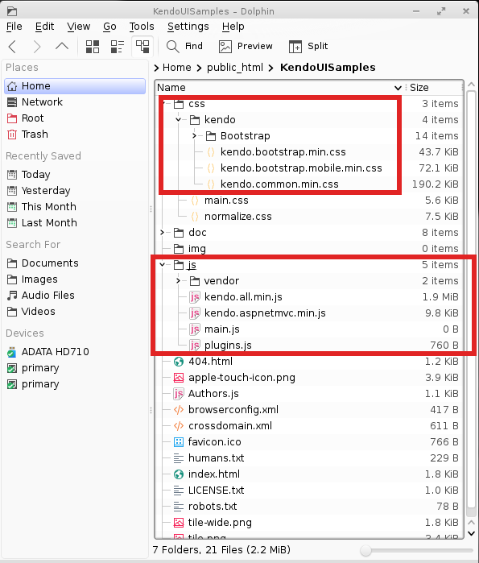
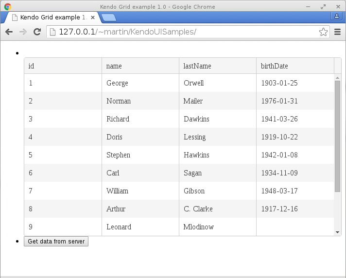

# Utilizando el Kendo UI Grid de Telerik con JQuery
		

Uno de los conjuntos de controles que he encontrado con más frecuencia en los desarrollos profesionales de sistemas son sin duda el conjunto de los controles Telerik, Telerik ofrece una amplia gama de controles para diseñar la interfaz gráfica de usuario o GUI (Graphical User Interface) en diferentes frameworks de .NET como: WPF, ASP.NET, Windows Form o Silverlight.

Voy a mostrar una breve utilización básica del <a href="http://demos.telerik.com/kendo-ui/grid/index">kendo UI Grid</a> con un formulario que hace una petición mediante <a href="http://jqueryui.com/">JQuery</a> a un servidor web en este caso Apache.

  <b>Paso 1:</b> 
  Voy a crear un directorio de trabajo llamado “KendoUISamples” debajo de ~/public_html que es el directorio predeterminado por OpenSuSe para ser el sitio web del usuario, todo lo que está dentro de ese directorio se publica en Apache con la siguiente dirección: http://127.0.0.1/~martin/

 

  <b>Paso 2:</b> 
  Dentro de ese directorio voy a crear un archivo de texto llamado <i>"Authors.js"</i> que contendrá los siguientes datos en formato JSON.
Estos datos servirán para ser el <a href="http://demos.telerik.com/kendo-ui/datasource/index">DataSource</a> del control Kendo UI Grid que voy a mostrar.  El directorio de trabajo se verá como en la siguiente imagen:
  

  
  
 

  <b>Paso 3:</b> 
  
Descargamos el HTML5 Boiler template <a href="http://xomalli.blogspot.mx/2015/10/utilizando-el-html-5-boiler-template.html">(ver este post)</a> y lo descomprimimos dentro del directorio de trabajo para que se genere la estructura básica de un proyecto Front-End HTML5,  se verá una estructura como en la siguiente imagen 

		  

		  
		  
 
		

		

		  <b>Paso 4:</b> 
		  Copiamos los archivos <b>css</b>  y <b>js</b> de JQuery y Kendo UI Telerik a los directorios css y js que están en el directorio de trabajo para tener una estructura como la que se muestra en la imagen
		  

		  
		  
 
		

		

		  <b>Paso 5:</b> 
		  Completamos el código del archivo [index.html] con las siguientes líneas dentro de las etiquetas &lt;head&gt; y &lt;/head&gt; para incluir a los archivos <b>css</b> y <b>js</b> de JQuery y Telerik.
En este paso se llaman a los archivos css y js de Jquery y Telerik respectivamente.
		

		

  <b>Paso 6:</b> 
  Inmediatamente después de la etiqueta <body> agregamos el siguiente código para crear los controles del formulario en donde están contenidos el control Kendo UI Grid y el botón que hará la petición.

  <b>Paso 7:</b> 
  Ahora viene la parte más importante de la página, en donde se escribe toda su funcionalidad, aquí iniciamos los controles DataSource, Kendo Grid y agregamos el evento del botón que realiza la petición al servidor.

		
Al abrir la página, y pulsar el botón se vera el siguiente resultado:

 
